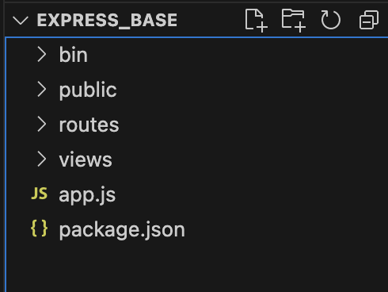

## express
express 는 외부 모듈을 설치해 사용할 수 있는 웹 프레임워크

(프레임워크: 내가 만들고 싶은 웹 서비스를 구현하는 데 필요한 모든 일을 틀안에서 할 수 있는 것)

#### express 설치
```
npm install express
```

<br>

## express 살펴보기


express-generator 모듈을 설치해서 express 기본 구조 살펴보기



#### bin/www 파일
- http 모듈을 사용하여 HTTP 서버 생성
- Express 애플리케이션의 진입점인 app.js 파일을 불러와서, 이를 HTTP 서버의 요청 핸들러로 사용
- 포트 설정 (기본값은 3000)
- server.listen(port) 메서드를 호출하여 서버가 지정된 포트에서 실행되도록 함

<br>

#### app.js
- express는 필요한 것이 다 셋팅되어 있는 프레임워크, app.js는 필요한 것이 다 셋팅되어 있음

<br>

뷰 엔진, 뷰 파일 경로를 설정하는 부분
```javascript
app.set('views', path.join(__dirname, 'views'));
app.set('views engine', 'jade');
```

<br>

미들웨어와 연결하는 부분
<br><br>
(express는 http 모듈을 기반으로 여러 모듈로 감싸 만든 편한 모듈인데, http를 제외한 다른 모듈을 미들웨어라고 함)

```javascript
app.use(logger('dev'));
app.use(express.json());
app.use(express.urlencoded({ extended: false }));
app.use(cookieParser());
app.use(express.static(path.join(__dirname, 'public')));

app.use('/', indexRouter);
app.use('users', usersRouter);
```

<br>
app.js를 모듈화 시킴

```javascript
module.exports = app;
```

<br>

#### pakage.json

스크립트 필드를 보면 npm start 명령어를 실행하면 ./bin/www 파일이 실행되는 것을 알 수 있다. ./bin/www 파일 내부에서 app.js 파일을 불러와 서버를 시작할 수 있는 진입점 역할을 한다.

```javascript
"scripts": {
    "start": "node ./bin/www"
},
```
<br>

## 실습 코드


```javascript
// express 모듈 셋팅
const express = require('express');
const app = express(); 
app.listen(8888);
```

<br>

db를 연결하는 대신 Map 자료구조를 사용해 db처럼 쓰기 위해 Map에 넣을 데이터 생성
```javascript
// data 셋팅
let user1 = {
    name : "김김김",
    email : "kim@programmers.co.kr",
    age: 14,
    sex: "F"
}

let user2 = {
    name : "이이이",
    email : "lee@programmers.co.kr",
    age: 21,
    sex: "M"
}

let user3 = {
    name : "박박박",
    email : "park@programmers.co.kr",
    age: 22,
    sex: "M"
}
```

<br>

Map을 만들고, 만들어둔 객체를 집어넣고,
id 값은 후위 연산자를 통해 증가시켜줌
```javascript
let db = new Map();
let id = 1; // id (map의 키 값)

db.set(id++, user1);
db.set(id++, user2);
db.set(id++, user3);
```

<br>

### <API 설계>

#### 개별 회원 조회 GET /users/:id
- id로 map에 저장된 객체 찾아서, 그 객체 정보를 화면에 뿌려줌
- req: params.id -> map에 저장된 key값을 전달
- res: map에서 id로 객체를 조회해서 전달

#### 회원 등록 POST /user
- 신규 회원 등록, 14세 미만 가입불가
- { name: ___, email: ___, age: ___, sex: ___ }
- req: 바디에 회원정보를 담아서 요청
- res: 
    * 14세 미만은 "14세미만은 가입이 불가능합니다" 메세지 돌려줌
    * 14세 이상은 "name님의 회원 등록이 완료되었습니다!" 메세지 돌려줌

<br>

#### 개별 회원 조회

```javascript
// id 별 조회
app.get('/users/:id', (req, res) => {
    let {id} = req.params; // Destructuring 문법
    id = parseInt(id);
    let user = db.get(id);

    if (user) {
        user.id = id; // id 필드 추가
        res.json(user);
    } else {
        res.json({
            msg: "등록된 회원이 아닙니다"
        });
    }
})

```
<br>

#### 회원 등록
```javascript
app.use(express.json()); // http 외 모듈인 미들웨어 json 설정
app.post('/user', (req, res) => {
    const userdata = req.body;
    const userage = userdata.age;
    if (userage < 14) {
        res.json({
            msg: "14세 미만은 가입이 불가능합니다"
        });
    } else {
        db.set(id++, userdata); // 회원등록
        res.json({
            msg: `${userdata.userName}님의 회원 등록이 완료되었습니다!`
        });
    }
})
```